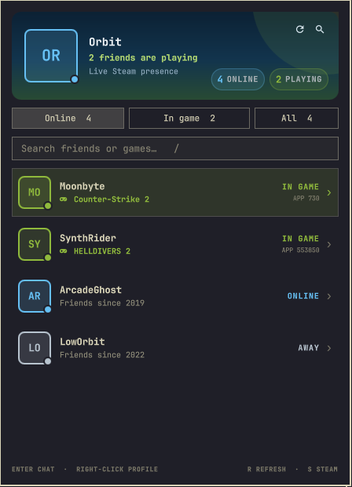

# Steam Friends for Omarchy

[](https://github.com/daventhedude/omarchy-steam-friends/actions/workflows/ci.yml)

A native, theme-aware Steam friends panel for the Omarchy Quattro bar. It keeps the people and games you care about one click away without embedding a browser or running another Quickshell process.



## Highlights

- Live online and in-game counts in the bar
- Steam avatars, presence states, current games, and last-seen times
- In-game, online, and all-friends filters plus instant search
- Click a friend to open Steam chat; right-click to open their profile
- Cold Steam starts are serialized with immediate in-panel feedback, so repeat clicks or Enter presses cannot launch competing clients
- Native keyboard flow: `j`/`k`, arrows, Enter, `/`, `r`, `s`, and Escape
- Runtime theme synthesis across Omarchy's dark, light, monochrome, and custom palettes
- Contrast-safe semantic text and status colors instead of fixed Steam-blue UI colors
- A data-driven Presence Orbit in the hero: outer arc online, inner arc in-game
- Native Omarchy control, spacing, typography, radius, border, hover, and focus tokens
- Stale-while-offline cache: the last good snapshot remains useful during outages
- No API secret in `shell.json`, process arguments, QML, logs, or the repository
- API keys travel in Steam's supported `x-webapi-key` header, never in request URLs
- Handles more than 100 friends by batching Steam summary requests

## Requirements

- Omarchy Quattro
- A Steam account with a public friends list
- A free [Steam Web API key](https://steamcommunity.com/dev/apikey)
- `curl`, `jq`, `flock`, `pgrep`, and `xdg-open` (all are part of a standard Omarchy installation)

Steam itself does not need to be running for presence to refresh. Steam is opened only when you choose a native action such as chat or Friends.

## Install

```bash
omarchy plugin add https://github.com/daventhedude/omarchy-steam-friends.git --enable
```

After installation, click the Steam icon and select **Open secure setup**. The terminal wizard detects the most recently used local Steam account, validates the API key, and stores this private file:

```text
~/.config/omarchy/steam-friends.json   mode 0600
```

The key is deliberately kept out of Omarchy's inline widget settings and shell logs. Existing credential files are accepted only when they are single-link, regular, user-owned, non-symlink files without group or world permissions.

Before connecting, review the [Privacy and Steam Data Notice](PRIVACY.md). By continuing, you direct the plugin to retrieve the listed Steam data for local display and caching under your own Steam Web API key.

## Remove

Remove the plugin and its bar entry with Omarchy's own plugin manager:

```bash
omarchy plugin remove io.github.daventhedude.steam-friends
```

The private API-key file and presence cache are intentionally kept so reinstalling does not silently lose your setup. To remove those too:

```bash
gio trash ~/.config/omarchy/steam-friends.json ~/.cache/omarchy-steam-friends
```

## Controls

| Input | Action |
| --- | --- |
| Left-click bar icon | Toggle the panel |
| Middle-click bar icon | Refresh presence |
| Right-click bar icon | Open Steam Friends |
| `j` / `k` or arrows | Select a friend |
| Enter or left-click | Open Steam chat |
| Right-click a friend | Open Steam profile |
| `/` | Focus search |
| `r` | Refresh |
| `s` | Open Steam Friends |
| Escape | Close search/panel |

When Steam is not already running, the first chat can take several seconds to
appear. The panel shows that startup immediately and safely ignores duplicate
actions until Steam's local command pipe is ready.

## Settings

Open **Omarchy → Setup → Bar** and edit Steam Friends to change:

- whether offline friends appear in the All tab;
- refresh frequency while the panel is open;
- lower-frequency background refresh for the bar badge.

## Privacy and security

The helper talks only to Valve's official HTTPS Web API endpoint. It sends the user-provided key in Steam's supported `x-webapi-key` header through `curl` standard input, disables user curl configuration, enforces TLS, and limits response sizes. The key is therefore absent from request URLs, process arguments, QML, logs, snapshots, and the repository.

Steam IDs and every response field are validated and length-bounded before entering QML. Profile URLs are reconstructed from validated IDs; avatars are limited to HTTPS Steam CDN hosts; dynamic text is rendered as plain text. The last valid snapshot is stored in a `0700` cache directory as a `0600` file and is accepted for at most 24 hours. A fresh account-bound snapshot is reused for 60 seconds, keeping automatic API traffic below Valve's daily limit even at the supported collection boundary.

Native Steam actions cross a second validation boundary in the helper. A
per-user file lock and timestamp-only startup guard serialize chat/Friends URI
dispatch across keyboard, pointer, bar, and helper processes. The guard never
stores a friend's Steam ID.

See [PRIVACY.md](PRIVACY.md) for the data-use, local-storage, Steam-data disclaimer, and non-affiliation notice. See [SECURITY.md](SECURITY.md) for the complete trust model and vulnerability-reporting process.

As with every Omarchy shell plugin, the code runs with your user permissions. Review the small helper script before installing if you would like to verify the complete data path.

## Development

Contribution and trust-boundary rules are documented in [CONTRIBUTING.md](CONTRIBUTING.md). Release history is recorded in [CHANGELOG.md](CHANGELOG.md).

```bash
omarchy plugin validate .
./scripts/steam-friends demo | jq .
./tests/security.sh
./tests/model-contract.mjs
./tests/ui-contract.mjs
./tests/theme-contract.mjs
QT_QPA_PLATFORM=offscreen /usr/lib/qt6/bin/qmltestrunner -input tests/tst_keyboard.qml
```

For a visual fixture without Steam credentials, add `"_demoMode": true` to the widget's local `shell.json` entry while developing. This setting is intentionally not exposed in the public settings form.

## License

[MIT](LICENSE)
